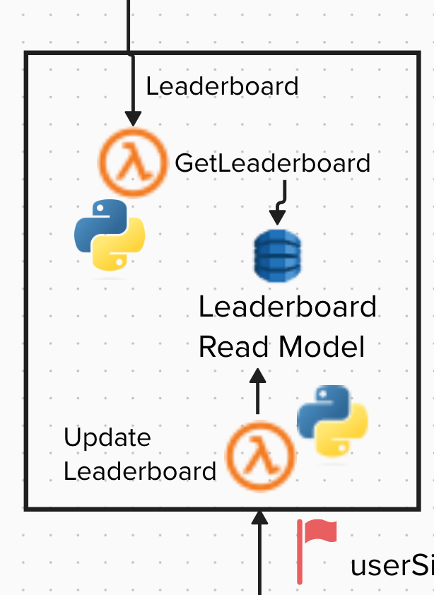

# Leaderboard Service

The leaderboard service creates a ranking list from the opponents' results and makes it available.

## Overview

## Technologies
* Python 3 and Boto3
* AWS Lambda
* DynamoDB

## Resources
* [Using Global Secondary Indexes in DynamoDB](https://docs.aws.amazon.com/amazondynamodb/latest/developerguide/GSI.html)